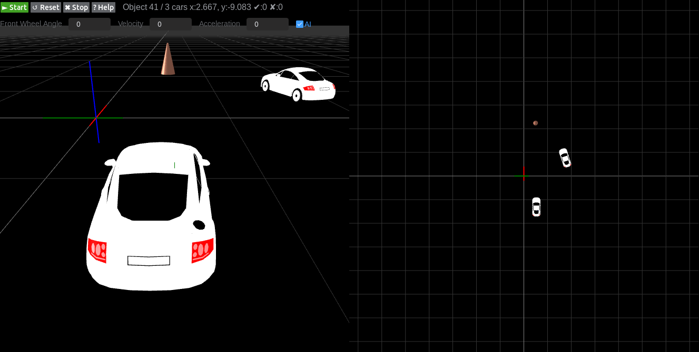

# DrivingSchool

DrivingSchool is a lightweight web-based 3D simulator. It is aimed at providing a simple and easy-to-use simulation environment for  reinforcement learning algorithms implemented in Python for autonomous vehicles.

DrivingSchool是一个轻量级的基于web开发的3D仿真软件。目标是为Python实现的无人车强化学习算法提供简单易用的仿真环境。

## Examples

An AI controlled vehicle run along axis x's direction, and find a way to arrive the point of (30,0) from any position on the axis x. You can see [video](https://v.youku.com/v_show/id_XNDA4MTUyMDQ1Mg==.html) for details.

## Requirements

* Python: >=3.0
* WebGL is supported on your web browser

## Preparation

1. Install the python web framework - tornado:

    pip install tornado

2. Install the deep learning platform - pytorch from https://pytorch.org/get-started/locally/

3. Install the visualization tool - visdom:

    pip install visdom

4. Download the codes of DrivingSchool:

    git clone https://github.com/Tumiz/DrivingSchool.git

## Run

1. Open a terminal in any directory and run command:

    visdom

1. Open an another terminal in the folder of DrivingSchool and run command:

    python server.py

## Operations

|    Wanted | Key 
----------- |-----
 Create a car| Ctrl + Mouse Left Click 
Choose a car| Mouse Left Click on the car
Acceleration | W
Deceleration| S
Turn Left| A
Turn Right|D
Stop simulation | Click the Button Stop
Reset all to origin| Click the Button Reset
Reconnect to the server|Click the Button Start